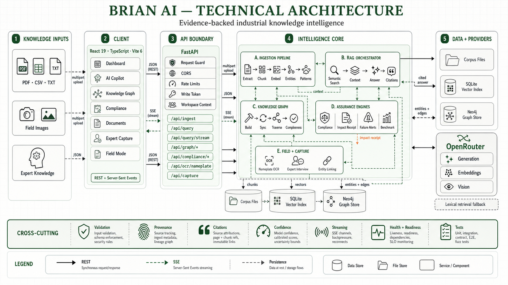
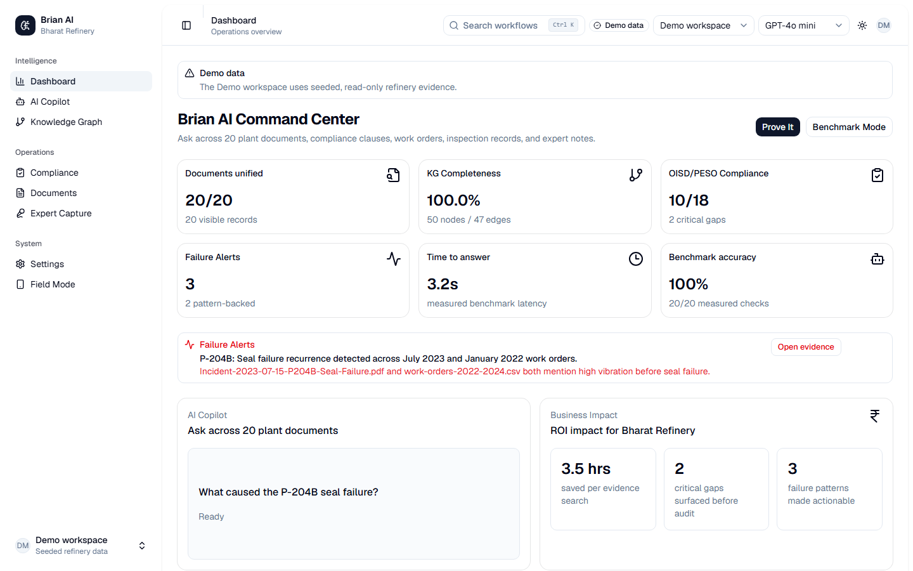
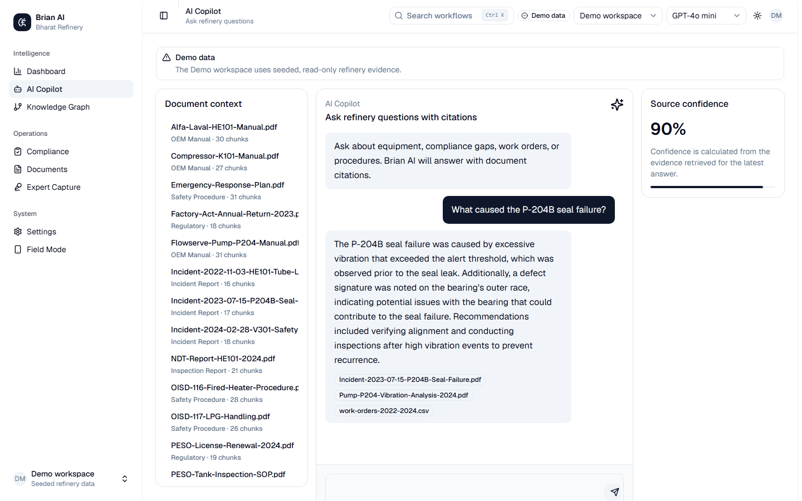
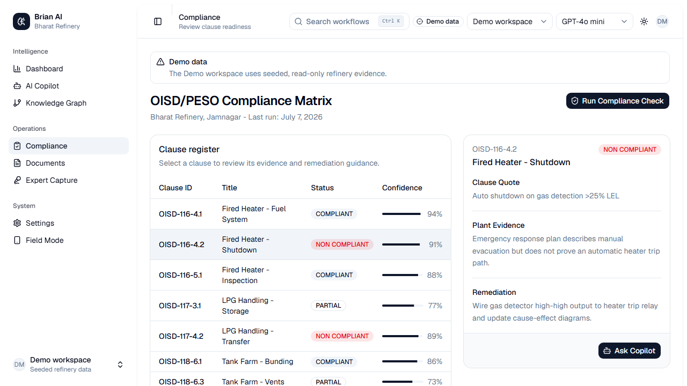
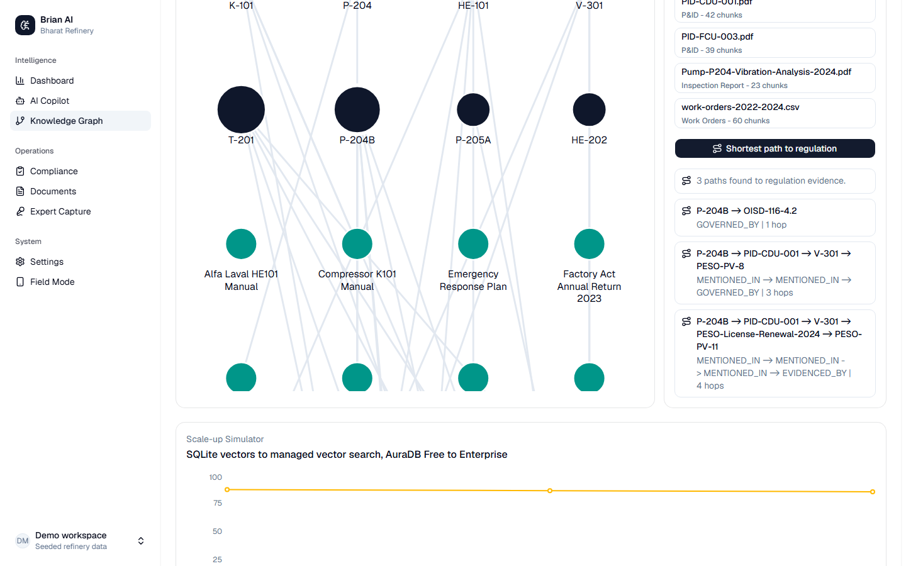
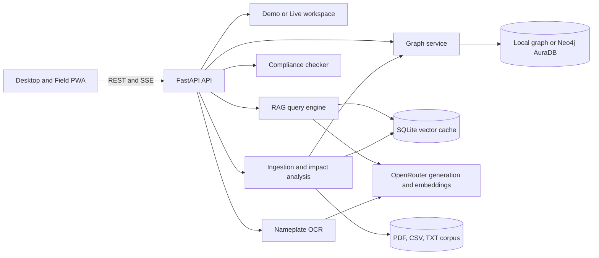

# Brian AI

### Evidence-backed industrial intelligence for refinery operations

Brian AI turns fragmented plant documents, compliance clauses, maintenance records, incident reports, and expert knowledge into cited answers and operational actions. The hackathon prototype unifies a 20-document refinery corpus, detects recurring equipment failure patterns, checks 18 OISD/PESO clauses, traces equipment-to-regulation paths, and serves the same knowledge in a field-ready PWA.



[Launch the live app](https://brian-ai-app.vercel.app/app) · [Watch the demo](https://youtu.be/t_bUzOsV0ag) · [Read the pitch deck](docs/Brian_AI_pitch_deck.pdf)

## Why this matters

Industrial teams make high-stakes decisions from information split across P&IDs, OEM manuals, inspection reports, work orders, incident records, regulatory submissions, and the memory of experienced operators. Finding the right evidence is slow. Connecting an incident to a prior warning or a compliance clause is harder. Generic chat tools can produce an answer, but they do not provide the traceability required before an audit, shutdown, or maintenance decision.

Brian AI creates one evidence-to-action workflow:

1. Ingest plant files and extract searchable chunks, document types, and equipment entities.
2. Retrieve relevant evidence using a warm SQLite vector cache with a lexical fallback.
3. Generate an answer with source citations and a confidence score.
4. Connect the same evidence to equipment, incidents, documents, and regulations in a knowledge graph.
5. Stream compliance findings, failure alerts, and recommended actions into purpose-built workflows.

## Product proof

### Command center

The dashboard exposes corpus coverage, graph completeness, compliance status, benchmark performance, failure alerts, and prototype impact in one operational view.



### Cited root-cause analysis

The Copilot answers the P-204B seal-failure question using the incident report, vibration analysis, and work-order history. Every answer returns citations and evidence-derived confidence.



### Clause-level compliance evidence

The compliance workflow checks 18 OISD/PESO clauses and exposes the clause text, plant evidence, confidence, remediation, and a direct handoff to Copilot.



### Equipment-to-regulation traceability

The graph connects equipment to related evidence and resolves shortest paths to regulatory nodes through the backend graph proxy.



## What judges can verify in five minutes

1. Open the [Command Center](https://brian-ai-app.vercel.app/app) and select **Prove It**.
2. Review the P-204B answer and open its supporting evidence.
3. Open [AI Copilot](https://brian-ai-app.vercel.app/copilot), ask `What caused the P-204B seal failure?`, and verify the three citations and confidence score.
4. Open [Compliance](https://brian-ai-app.vercel.app/compliance), run the check, and inspect `OISD-116-4.2` for the clause quote, plant evidence, and remediation.
5. Open [Knowledge Graph](https://brian-ai-app.vercel.app/knowledge-graph), select `P-204B`, and request the shortest path to a regulation.
6. Open [Field Mode](https://brian-ai-app.vercel.app/field) to test manual tag lookup, voice fallback, offline answer history, and sunlight mode.
7. Open [Expert Capture](https://brian-ai-app.vercel.app/capture) to review the five-question interview and ingestion flow.

The public app opens in a seeded, read-only Demo workspace. Live ingestion is isolated behind the Live workspace and a server-validated access token.

## Core capabilities

| Capability | User outcome | Implementation |
|---|---|---|
| Evidence-backed Copilot | Answers operational questions with citations and confidence | FastAPI query service, semantic or lexical retrieval, model routing, REST and SSE responses |
| Compliance intelligence | Finds missing or partial evidence across 18 OISD/PESO clauses | Clause registry, corpus matching, three-clause processing batches, SSE progress and result events |
| Failure intelligence | Surfaces recurring equipment patterns before the next event | Entity extraction, cross-document pattern rules, incident and work-order evidence |
| Knowledge graph | Traces equipment to documents, incidents, and regulations | FastAPI graph proxy, shortest-path queries, local corpus graph, optional Neo4j AuraDB adapter |
| Document impact receipts | Explains what a new document changes | Extracted entities and facts, graph changes, alerts, compliance impacts, RCA hypotheses, provenance |
| Field PWA | Brings the knowledge base to technicians at the asset | Installable React PWA, service worker, camera upload, vision OCR with local fallback, voice query, five-answer offline cache |
| Expert Capture | Converts tacit knowledge into searchable plant evidence | Five-question interview, review step, structured corpus file, automatic document registration and graph refresh |
| Benchmark mode | Makes quality and latency visible | Cached evaluation suite, SSE result stream, live spot checks, question accuracy and entity-extraction metrics |

## Architecture



### Evidence-to-action pipeline

```text
Plant file
  -> type classification and text extraction
  -> equipment and regulation entity extraction
  -> chunking and warm vector indexing
  -> cited retrieval and confidence scoring
  -> graph linkage and cross-document pattern detection
  -> compliance impact, RCA hypotheses, alerts, and recommended actions
```

The frontend never connects directly to model or graph providers. Provider credentials stay on the FastAPI service. The browser receives normalized API responses and streaming events, so local fallbacks and production providers share one UI contract.

## Technical implementation

### Frontend

- React 19, TypeScript 5.7, Vite 6, Tailwind CSS 4, shadcn/ui, Radix UI, Zustand, and Recharts.
- Eight code-split routes wrapped in page-level error boundaries.
- Server-Sent Events for token streaming, compliance progress, benchmark rows, and five-step ingestion progress.
- Installable PWA with a manifest, 192px and 512px icons, service-worker shell caching, network-first GET API caching, and offline navigation fallback.
- Demo and Live workspaces with session-scoped write credentials. Demo stays read-only.

### Backend and retrieval

- FastAPI 0.115 with typed Pydantic request and response models.
- PDF extraction through `pypdf`, plus CSV and text ingestion.
- SHA-256 chunk identities prevent duplicate embedding work in the SQLite cache.
- Embeddings are indexed in batches of 32. Search ranks stored vectors by cosine similarity and can scope retrieval to one source file.
- OpenRouter supports generation, embeddings, and Gemini vision. Deterministic lexical, OCR, and graph fallbacks keep the demo operable without paid providers.
- Query input is limited to 2,000 characters. Document uploads accept PDF, CSV, and TXT up to 10 MiB by default. Image uploads accept JPG, PNG, and WebP up to 5 MiB by default.

### Graph, compliance, and reasoning

- The local graph is derived from corpus entities and relationships. Neo4j AuraDB is optional and runs behind the same service interface.
- Neo4j startup creates schema constraints, refreshes graph data, and enables an hourly keep-alive when configured.
- Shortest-path queries return the nodes, relationship sequence, target type, and hop depth used by the UI.
- Compliance results preserve the clause quote, candidate plant evidence, status, confidence, and reviewer-ready remediation.
- Impact receipts separate extracted facts from ranked hypotheses and record provenance for every linked source.

### Security and deployment

- Vercel serves the Vite frontend. Railway runs the FastAPI container and `/health` deployment check.
- CORS origins are configured server-side.
- Query and OCR routes use per-client sliding-window rate limits. Defaults are 30 query requests and 10 write requests per minute.
- Production writes require `X-Brian-Write-Token`, checked with constant-time comparison.
- `X-Brian-Workspace` isolates seeded Demo data from mutable Live data for the full request, including SSE streams.
- Upload guards enforce allowlisted extensions, size limits, and non-empty payloads before ingestion.

## API surface

| Method | Endpoint | Purpose |
|---|---|---|
| `GET` | `/health` | Version, workspace, and corpus count |
| `GET` | `/api/system/status` | Provider, index, deployment, and readiness status |
| `POST` | `/api/query` | Cited synchronous answer |
| `POST` | `/api/query/stream` | Token, citation, confidence, and completion events over SSE |
| `POST` | `/api/ingest` | Protected PDF, CSV, or TXT ingestion with optional SSE progress |
| `GET` | `/api/documents/{filename}/impact` | Entities, facts, graph changes, alerts, compliance impacts, RCA, and provenance |
| `GET` | `/api/compliance/check` | Clause progress and findings over SSE |
| `POST` | `/api/graph/query` | Shortest path from an entity to a target node type |
| `POST` | `/api/ocr/nameplate` | Equipment tag extraction from a field image |
| `POST` | `/api/capture` | Protected expert-knowledge ingestion |
| `GET` | `/api/benchmark` | Cached JSON or streamed benchmark rows based on the `Accept` header |

Interactive OpenAPI documentation is available at `http://127.0.0.1:8000/docs` when the backend runs locally.

## Prototype indicators

These are hackathon prototype indicators from the seeded refinery scenario, not customer traction or production claims.

| Indicator | Prototype result |
|---|---:|
| Evidence-search time saved | 3.5 hours per search |
| Critical compliance gaps surfaced | 2 |
| Failure patterns made actionable | 3 |
| Seed corpus | 20 documents |
| Compliance coverage | 18 clauses |
| Public vector cache | 107 chunks across 20 files |
| Measured benchmark checks | 20/20 passed in the seeded suite |

## Run locally

### Option 1: Docker Compose

```bash
docker compose up --build
```

Open `http://localhost:5173`. The API runs at `http://localhost:8000`.

### Option 2: Run each service

Requirements: Node.js 20 or newer and Python 3.11 or newer.

Start the API from the backend directory:

```bash
cd backend
python -m venv .venv
# Windows: .venv\Scripts\activate
# macOS/Linux: source .venv/bin/activate
pip install -r requirements.txt
uvicorn main:app --reload --port 8000
```

Create `frontend/.env.local`:

```dotenv
VITE_API_URL=http://127.0.0.1:8000
```

Start the frontend in a second terminal:

```bash
cd frontend
npm ci
npm run dev
```

The seeded Demo workspace works without external credentials.

## Enable production providers

Set these on the backend service. The values below are placeholders.

```dotenv
ENVIRONMENT=production
BRIAN_AI_DATA_DIR=/data
BRIAN_AI_WRITE_TOKEN=replace-with-a-long-random-token
BRIAN_AI_USE_OPENROUTER=1
OPENROUTER_API_KEY=replace-with-your-openrouter-key
OPENROUTER_EMBEDDING_MODEL=
OPENROUTER_VISION_MODEL=openrouter/free
NEO4J_URI=neo4j+s://your-instance.databases.neo4j.io
NEO4J_USER=neo4j
NEO4J_PASSWORD=replace-with-your-neo4j-password
ALLOW_ORIGINS=https://your-frontend.example
FRONTEND_PUBLIC_URL=https://your-frontend.example
BACKEND_PUBLIC_URL=https://your-backend.example
```

Set `VITE_API_URL` to the public backend URL during the frontend build. Then open `/settings` and verify every production-readiness check.

Brian AI only submits `openrouter/free` or explicit `:free` model variants. Paid model IDs are rejected by the backend. Leaving `OPENROUTER_EMBEDDING_MODEL` empty keeps retrieval on the built-in lexical fallback instead of calling a paid embedding model.

## Verification

Run the repeatable backend checks from the repository root:

```bash
python -m compileall backend
python scripts/prebuild_index.py
python scripts/prebuild_benchmark.py
python scripts/smoke_backend.py
```

Run the frontend type check and production build:

```bash
cd frontend
npm ci
npm run lint
npm run build
```

## Repository map

```text
backend/
  compliance/       Clause definitions and SSE checker
  ingestion/        Classification, entity extraction, chunking, and indexing
  knowledge_graph/  Local and Neo4j graph service
  ocr/              Vision and deterministic nameplate extraction
  rag/              Retrieval, generation, citations, and streaming
frontend/
  public/            PWA manifest, service worker, icons, and brand assets
  src/pages/         Dashboard, Copilot, Graph, Compliance, Documents, Capture, Field, Settings
scripts/             Corpus generation, index builds, benchmarks, and smoke checks
docs/                Pitch deck and public-link checklist
assets/readme/       Fresh desktop screenshots from the deployed app
```

## Submission assets

- [Demo video](https://youtu.be/t_bUzOsV0ag)
- [10-page pitch deck](docs/Brian_AI_pitch_deck.pdf)
- [Public links checklist](docs/PUBLIC_LINKS_CHECKLIST.md)

## Team

Built by [Yash Dugar](https://www.yashdugar.com), working at the intersection of AI, data, and business.

## Pilot ask

Run Brian AI against a real plant document set, connect DMS and SAP exports, validate nameplate OCR on field imagery, and measure time-to-evidence, audit-gap detection, and recurrence-alert precision with refinery users.
